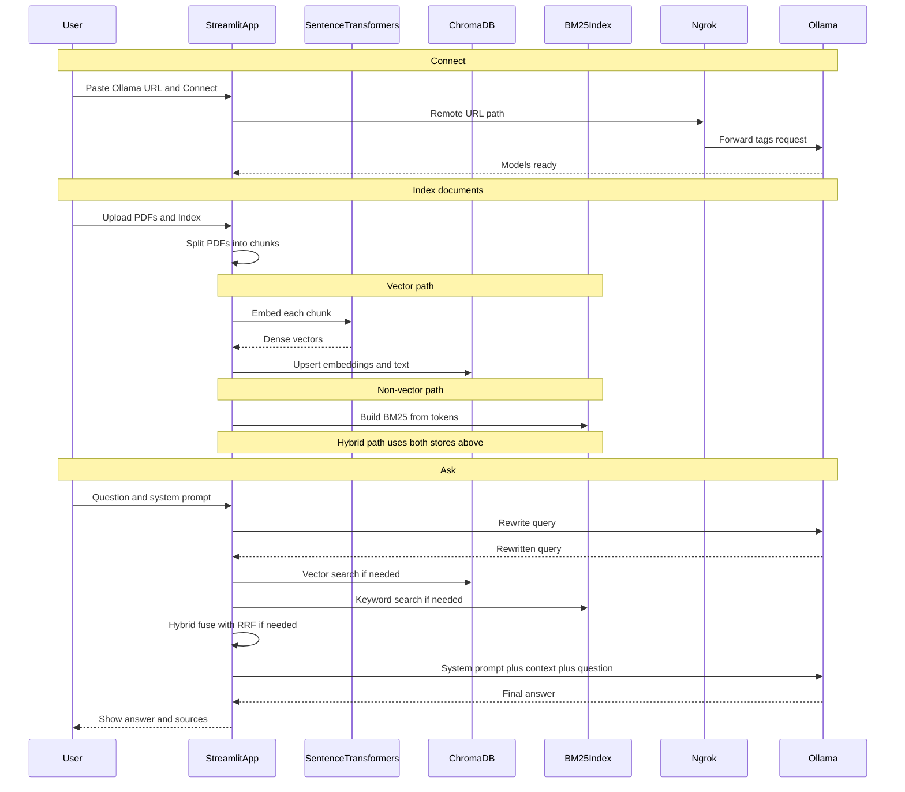

# Visual RAG Pipeline

A Streamlit app for local Retrieval-Augmented Generation (RAG) over PDF documents.

You connect to a **llama** model served by **Ollama** on your machine. Optionally expose that Ollama instance through **ngrok** so a Streamlit Cloud deployment can reach it. Documents are chunked, indexed (vector, non-vector, or hybrid), retrieved against the user question, and answered with a configurable system prompt.

---

## End-to-end request flow



---

## Components

### Llama model via Ollama

- Default model: `llama3.2:1b`
- Served locally by Ollama on `http://127.0.0.1:11434`
- Used for:
  - rewriting the user question into a better retrieval query
  - generating the final answer from retrieved context
- The Streamlit process does **not** run the LLM weights itself; it only calls the Ollama HTTP API

### ngrok channel

- Streamlit Cloud cannot reach `127.0.0.1` on your laptop
- ngrok creates a public HTTPS URL that forwards to local Ollama
- Required flag so Ollama accepts proxied requests:

```bash
ngrok http 11434 --host-header="localhost:11434"
```

- Closing the ngrok terminal stops the tunnel; the Cloud app can no longer reach your model until you start it again
- Local runs can skip ngrok and use `http://127.0.0.1:11434` directly
- The app asks for an Ollama URL so each user can point at their own tunnel or local endpoint

### Sentence Transformers embeddings

- Model: `all-MiniLM-L6-v2`
- Turns each text chunk into a dense vector
- Used for **vector** and **hybrid** indexing and retrieval

### Indexing modes

| Mode | What is built | How search works |
|------|----------------|------------------|
| Vector indexing | Dense embeddings stored in ChromaDB | Embed the query, nearest-neighbor search in Chroma |
| Non-vector indexing | BM25 keyword index in memory | Token overlap / BM25 scores over chunks |
| Hybrid indexing | Both Chroma vectors and BM25 | Run both searches, merge with Reciprocal Rank Fusion RRF |

Only one mode can be selected at index time. Retrieval later uses the mode that was chosen when documents were indexed.

### ChromaDB storage

- Persistent path: `data/chroma_db_app`
- Stores chunk ids, embedding vectors, document text, and metadata source / page
- Used by vector and hybrid modes
- Non-vector mode does not write embeddings to Chroma

### System prompt

- Editable in the UI as **LLM role**
- Sent as the Ollama system message when generating the answer
- Instructs the model how to behave using only the retrieved document context

### User query and output generation

1. User enters a question
2. Ollama rewrites the question for retrieval
3. The active index returns top chunks
4. Chunks are packed into a context block
5. Ollama answers with: system prompt + context + original question
6. Streamlit shows the answer and short source hints

---

## Project layout

```text
app.py                 Streamlit UI
rag/
  engine.py            Chunking, indexing, retrieval, RAG ask()
  ollama_client.py     Ollama connect / rewrite / answer
  __init__.py
requirements.txt       Streamlit Cloud / pip dependencies
runtime.txt            Python version for Streamlit Cloud
packages.txt           System packages for Cloud builds
data/chroma_db_app/    Local Chroma persistence ignored by git
.streamlit/config.toml Theme
```

---

## Local setup

### Prerequisites

- Python 3.11+ recommended 3.12 for Streamlit Cloud
- [Ollama](https://ollama.com) installed
- Optional: [ngrok](https://ngrok.com) for remote / Cloud access

### Install and run

```bash
# Pull the model
ollama pull llama3.2:1b

# Ollama is often already running; if not:
ollama serve

# App dependencies
uv sync
# or: pip install -r requirements.txt

# Start the UI
uv run streamlit run app.py
# or: streamlit run app.py
```

Open `http://localhost:8501`.

Connect with:

```text
http://127.0.0.1:11434
```

Then set chunk size / overlap, pick an indexing mode, upload PDFs, click **Index Documents**, optionally **Show Chunks and Vectors Generated**, then ask.

---

## Using ngrok for Streamlit Cloud

Keep these running on your machine while the Cloud app needs your model:

```bash
ollama serve
ollama pull llama3.2:1b
ngrok http 11434 --host-header="localhost:11434"
```

Copy the `https://....ngrok-free.dev` URL.

In the Streamlit app, paste that URL and click **Connect**.

Optional Cloud secret default:

```toml
OLLAMA_BASE_URL = "https://YOUR-SUBDOMAIN.ngrok-free.dev"
```

---

## Typical UI workflow

1. Connect to Ollama URL
2. Set LLM role system prompt
3. Choose chunk size and chunk overlap
4. Select one indexing mode: Vector, Non Vector, or Hybrid
5. Upload PDF files
6. Click **Index Documents** indexing does not start on upload alone
7. Optionally open **Show Chunks and Vectors Generated**
8. Ask a question and read the generated answer

---
